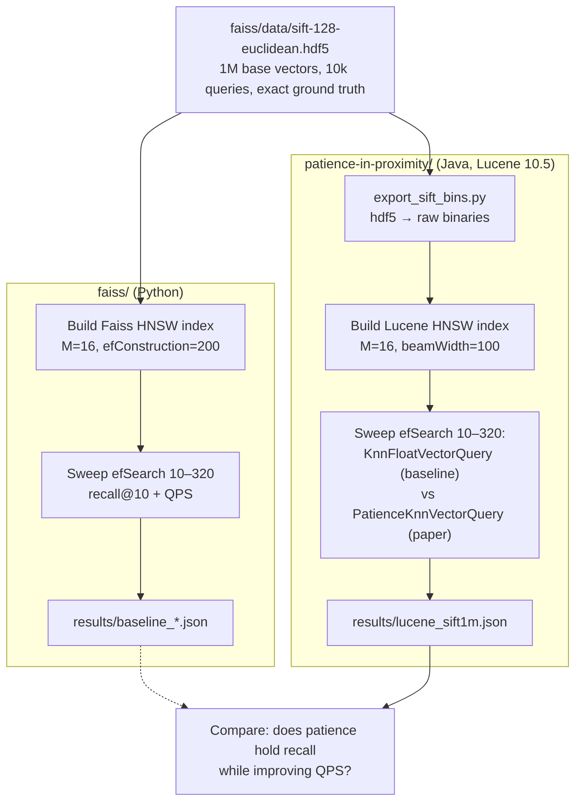

# ANN Search Research

Experiments on improving approximate k-nearest neighbor (k-NN) search, focused on
HNSW (Hierarchical Navigable Small World) graph traversal.

## Papers

### 1. Patience in Proximity (`patience-in-proximity/`)

> Tommaso Teofili and Jimmy Lin.
> **"Patience in Proximity: A Simple Early Termination Strategy for HNSW Graph
> Traversal in Approximate k-Nearest Neighbor Search."**
> ECIR 2025, LNCS 15574, pp. 401–407.
> DOI: [10.1007/978-3-031-88714-7_39](https://doi.org/10.1007/978-3-031-88714-7_39)

The paper proposes a saturation-based early-termination strategy ("patience") for
HNSW graph traversal: instead of exhaustively exploring candidate neighbors, the
search halts once results stop improving, reducing computational cost without
significantly hurting accuracy. Evaluated on datasets from the BEIR benchmark.

The paper's experiments ran on **Apache Lucene's** HNSW implementation (v9.11.1,
via Anserini). The authors later merged the strategy into Lucene itself
([apache/lucene#14094](https://github.com/apache/lucene/pull/14094)), shipped
since Lucene 10.2 as
[`PatienceKnnVectorQuery`](https://lucene.apache.org/core/10_2_2/core/org/apache/lucene/search/PatienceKnnVectorQuery.html)
— so our experiments run the authors' actual production implementation.

### 2. Ada-ef / Distribution-Aware HNSW (`hnsw-ada-ef/`, `pyhnsw/`)

> Chao Zhang and Renée J. Miller.
> **"Distribution-Aware Exploration for Adaptive HNSW Search."**
> SIGMOD 2026 (accepted). arXiv:2512.06636

Instead of one global `efSearch`, Ada-ef takes a *declarative recall target*
(e.g. 0.95) and picks `ef` per query at runtime, using a Gaussian estimate of
the query's distance distribution built from dataset statistics (mean vector +
covariance matrix) computed offline. See **[ADA_EF_EXPLAINED.md](ADA_EF_EXPLAINED.md)**
for a full walkthrough of the offline and online phases.

`hnsw-ada-ef/` is a clone of the authors' official C++ repo (it also contains
their reference implementation of PIP at `hnswlib/hnswalg.h:1859`).
`pyhnsw/` is our Python re-implementation of both papers on a shared engine.

## Repo layout

```
pyhnsw/                    Unified Python engine: baseline + PIP + Ada-ef
  graph.py                   Faiss builds the HNSW graph; we extract it to numpy
  search.py                  one instrumented best-first loop, 3 termination policies
  ada_ef.py                  Ada-ef offline phase (stats, proxy GT, ef table) + online estimator
  experiments.py             E1–E6 experiment runner (JSON to results/)
  plots.py                   charts (PNG to results/figs/)
tools/                     helper tooling: slide builders, decks, talk notes (not committed)
ADA_EF_EXPLAINED.md        plain-language walkthrough of Ada-ef offline/online
results/                   experiment JSONs + figs/ + cached Ada-ef estimator
faiss/                     Faiss HNSW baseline (Python)
  baseline_hnsw.py           efSearch sweep: recall@10 + QPS vs ground truth
  data/                      SIFT1M + GloVe hdf5, cached indexes/graphs (not committed)
  results/                   benchmark results (JSON)
patience-in-proximity/     Paper + Lucene experiments (Java, paper's engine)
  PIP.pdf                    the paper
  export_sift_bins.py        dumps SIFT1M arrays to raw binaries for Java
  LuceneHnswBenchmark.java   index + search benchmark: baseline vs patience
  lib/                       lucene-core jar
  data/, index/, results/    binaries, Lucene index, results (not committed)
hnsw-ada-ef/               Authors' official Ada-ef C++ repo (reference only)
```

## Datasets

Both from [ann-benchmarks](https://ann-benchmarks.com), with 10k queries and
exact top-100 ground truth each:

- **SIFT1M** (`sift-128-euclidean`, L2): 1M × 128.
  `curl -L -o faiss/data/sift-128-euclidean.hdf5 http://ann-benchmarks.com/sift-128-euclidean.hdf5`
- **GloVe-100** (`glove-100-angular`, cosine): 1.18M × 100 — used in the
  Ada-ef paper; its Gaussian theory requires inner-product/cosine.
  `curl -L -o faiss/data/glove-100-angular.hdf5 http://ann-benchmarks.com/glove-100-angular.hdf5`

## Running

```bash
# Python env (once)
uv venv --python 3.13 .venv
uv pip install --python .venv/bin/python -r requirements.txt

# Faiss baseline
.venv/bin/python faiss/baseline_hnsw.py

# Unified Python engine: all experiments, charts, slides
.venv/bin/python -m pyhnsw.experiments all   # E1–E6 → results/*.json
.venv/bin/python -m pyhnsw.plots             # → results/figs/*.png
.venv/bin/python tools/make_slides.py        # → tools/slides/meeting-2026-08-12.pptx

# Lucene benchmark (needs OpenJDK 21: brew install openjdk@21)
JAVA=/opt/homebrew/opt/openjdk@21/bin
.venv/bin/python patience-in-proximity/export_sift_bins.py
cd patience-in-proximity
$JAVA/javac -cp lib/lucene-core-10.5.0.jar -d build LuceneHnswBenchmark.java
$JAVA/java --add-modules jdk.incubator.vector -Xmx6g \
    -cp build:lib/lucene-core-10.5.0.jar LuceneHnswBenchmark index data index
$JAVA/java --add-modules jdk.incubator.vector -Xmx4g \
    -cp build:lib/lucene-core-10.5.0.jar LuceneHnswBenchmark search data index results/lucene_sift1m.json
```

## Pipeline (current state)



## Results so far (SIFT1M, Lucene 10.5, single-threaded, M=16)

| efSearch | baseline recall@10 | patience recall@10 | baseline QPS | patience QPS | QPS gain |
|---|---|---|---|---|---|
| 10 | 0.7183 | 0.7183 | 21,492 | 23,294 | +8% |
| 40 | 0.9234 | 0.9230 | 9,934 | 10,094 | +2% |
| 80 | 0.9689 | 0.9665 | 5,690 | 5,950 | +5% |
| 160 | 0.9888 | 0.9852 | 3,096 | 3,647 | +18% |
| 320 | 0.9966 | 0.9925 | 1,682 | 2,470 | +47% |

Consistent with the paper: patience pays off most in the high-exploration regime
(large efSearch), where exhaustive HNSW wastes visits on candidates that no
longer improve the top-k; recall cost stays under half a point.

## Results — unified Python engine (pyhnsw, k=10, 1000 queries)

Engine validation (E1): the Python search loop reproduces Faiss C++ recall at
every efSearch value on SIFT1M to within ±0.0002 (residual difference is
tie-breaking on equal distances).

**PIP** (E2): reproduces on SIFT1M — at ef=160, distance computations drop
2,748 → 1,235 (−55%) for recall 0.994 → 0.962; the Lucene production run shows
the same pattern in QPS. But on GloVe-100 (hard, skewed embedding space) PIP
**plateaus at recall ≈ 0.80** no matter how large ef is — saturation of the
top-k is a misleading stopping signal under hubness (the Ada-ef paper reports
the same weakness).

**Ada-ef vs PIP head-to-head** (E5/E6, GloVe-100, target recall 0.95):

| method | avg recall | p5 | p1 | dist comps/query |
|---|---|---|---|---|
| HNSW ef=160 | 0.853 | 0.30 | 0.10 | 3,429 |
| HNSW ef=640 | 0.934 | 0.60 | 0.30 | 11,033 |
| PIP (γ=.95, Δ=30) | 0.799 | 0.20 | 0.10 | 1,942 |
| **Ada-ef (target .95)** | **0.980** | **0.90** | **0.70** | 30,800 |
| Hybrid: Ada-ef + patience Δ=0.5·ef | 0.976 | 0.90 | 0.70 | 23,247 |
| Hybrid: Ada-ef + patience Δ=400 | 0.946 | 0.70 | 0.50 | 11,388 |

Ada-ef is the only method that meets the declarative target — overshooting it
on GloVe (the paper's own GloVe results overshoot too), with a transformed
tail (p5: 0.30 → 0.90 vs fixed ef=160). Its offline phase costs ~16s on a
laptop. The hybrid (patience early-exit *inside* Ada-ef's per-query budget)
cuts Ada-ef's cost by 25% with the tail intact when patience scales with the
estimated ef, or by 63% dipping just under target with a fixed Δ — the
per-query stopping *signal* is the real open problem.

Charts in `results/figs/`; deck in `tools/slides/meeting-2026-08-12.pptx`.

## Results — k=100 / k=1000 and the PIP-paper replication (E8, 2026-08-17)

The PIP paper's win is *large-k* retrieval (BEIR, k=1000): equal quality at
lower cost. E8 reruns the frontier at k ∈ {100, 1000} (exact GT@1000
brute-forced and cached in `faiss/data/*_gt1000_q1000.npy`) and reproduces the
paper's Table 1 in-engine, same beam ef=4000 for both methods:

| dataset | method | R@10 | R@100 | R@1000 | dist/query |
|---|---|---|---|---|---|
| SIFT1M | HNSW ef=4000 | 0.9985 | 0.9998 | 0.9997 | 33,275 |
| SIFT1M | PIP γ=.999 Δ=300 | 0.9985 | 0.9995 | 0.9901 | **11,864 (−64%)** |
| GloVe-100 | HNSW ef=4000 | 0.9862 | 0.9732 | 0.9301 | 54,920 |
| GloVe-100 | PIP γ=.999 Δ=300 | 0.9786 | 0.9572 | 0.8786 | 29,389 (−46%) |

Key findings: (1) both PIP knobs must scale with k — Lucene's production
defaults are γ=0.995, Δ=max(7, 0.3k), not the γ=0.95/Δ=30 the Ada-ef paper
used, and at k=1000 even γ=0.995 is too loose on GloVe (γ=0.95 tolerates 50
churning neighbors per hop); (2) with production parameters PIP sits *on* the
baseline frontier at large k instead of below it (k=10); (3) GloVe's hard
tail still pays (R@1000 −5pt, p5 0.72) — saturation stopping overcharges
exactly the queries E7/E9 explain.

## Results — what makes a query hard (E7 + E9, GloVe-100)

E7 (correlational, all 1000 queries): hard queries' true neighbors barely
stand out from random vectors (rel_contrast, Spearman +0.71 with recall) and
are spread far apart from each other (gt_pairwise −0.52); GT in-degree shows
no signal (hardness ≠ unpopular nodes). E9 (causal, `pyhnsw/hardness2.py`):

- **Asymptote:** hard-bin (34 queries ≤0.25 recall@10 at ef=160) recall climbs
  0.16 → 0.93 as ef goes 160 → 5120 with no plateau — the GT *is* reachable,
  at ~22× the cost.
- **Oracle entry:** starting the search at the query's true NN only lifts
  0.16 → 0.33 (ef=160) and 0.60 → 0.64 (ef=640) — routing is not the
  bottleneck; even from inside the GT the beam cannot reach the rest of it.
- **Cost link:** per-query distance computations correlate ρ=−0.82 with
  rel_contrast and ρ=+0.77 with GT spread — hard and expensive for the same
  geometric reason.

Verdict: hardness is caused by data geometry (scattered, low-contrast GT that
the graph never wires together) and is only fixable by per-query budget, not
by better routing — direct evidence for the adaptive-budget direction.

Deck for the follow-up meeting: `tools/slides/meeting-2026-08-19.pptx`
(`tools/make_slides2.py`).

## Research directions

1. **Distribution-aware early termination with a recall contract** (primary;
   E6 is day-one evidence): replace PIP's global (γ, Δ) with per-query values
   derived from Ada-ef's query score — stop when the estimated probability
   that the top-k is final exceeds the target. Ada-ef tail guarantees at
   PIP-like cost, no learned model (vs DARTH).
2. **Extend Ada-ef to L2/Euclidean** — explicitly open in the paper; the
   authors left a commented-out `SquaredEuclideanDistanceEstimator` draft in
   `hnsw-ada-ef/hnswlib/distribution.h`.
3. **Distribution-aware index construction** — both papers only touch search;
   use FDL statistics to set per-insert efConstruction.
4. **Saturation trajectory as a free online recall estimator** — φ-history as
   a per-query recall certificate, compared against DARTH's learned predictor.
5. **Layer-specific patience** — PIP's own future-work note.

## Experiment plan

1. **Phase 1 (SIFT1M):** ✅ Faiss baseline; Lucene baseline-vs-patience benchmark
   using the paper's engine and the authors' merged implementation.
2. **Phase 2 (unified engine):** ✅ PIP + Ada-ef + hybrid on SIFT1M and
   GloVe-100 (E1–E6 in `pyhnsw/experiments.py`).
3. **Phase 3 (scale to the papers' settings):** MS MARCO embeddings, k=100,
   DARTH baseline; BEIR datasets (TREC-COVID first) with `bge-base-en-v1.5`
   for the PIP comparison.

## Tools

- **[Faiss](https://github.com/facebookresearch/faiss)** (Python) — Meta's
  similarity-search library; our independent HNSW reference implementation.
- **[Apache Lucene](https://lucene.apache.org)** (Java) — the search engine the
  paper's experiments ran on; ships the authors' `PatienceKnnVectorQuery`.
- **OpenJDK 21** — required by Lucene 10.x (`brew install openjdk@21`).
